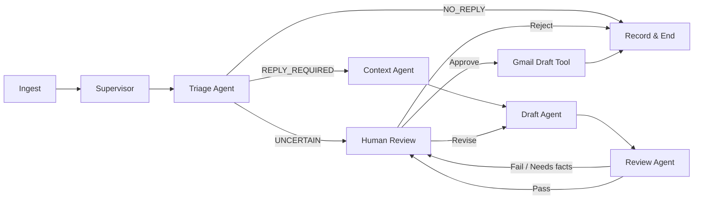
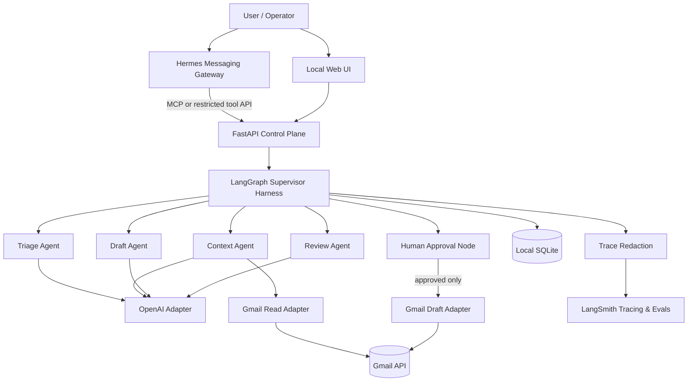

# Gmail 회신 분류·초안 생성 멀티 에이전트 — PRD

- 문서 상태: Draft v0.1
- 작성일: 2026-09-14
- 기본 구현안: Python 3.11–3.13, FastAPI, LangGraph 1.x, LangSmith, OpenAI, Hermes Agent Gateway
- 제품 원칙: 자동 발송 금지, 최소 권한, 사람 승인, 관측 가능한 멀티 에이전트

## 1. Executive Summary

### Problem Statement

사용자는 Gmail 받은편지함에서 회신이 필요한 메일을 직접 선별하고 문맥에 맞는 답장을 작성하는 데 반복적인 시간을 사용한다. 단일 에이전트 방식은 분류, 초안 작성, 정책 검증의 책임이 결합되어 있어 오류 진단과 미래의 전문 에이전트 추가가 어렵다.

### Proposed Solution

Hermes Agent Gateway를 운영자 접점으로, FastAPI를 애플리케이션 경계로 사용하고, LangGraph Supervisor가 `분류 → 문맥 수집 → 초안 작성 → 품질·안전 검증 → 사람 승인` 전문 에이전트를 조율하는 로컬 우선 시스템을 구축한다. Gmail에는 초안만 저장하며 전송 권한과 자동 발송 경로를 제공하지 않고, LangSmith에서 각 노드의 추적·오프라인 평가·오류 진단을 수행한다.

Hermes의 자체 에이전트 루프와 LangGraph가 경쟁하지 않도록 역할을 분리한다. Hermes Gateway는 사용자 명령과 상태 알림을 전달하고, Gmail 처리 워크플로의 단일 진실 공급원은 LangGraph로 유지한다. 두 계층은 MCP 또는 제한된 FastAPI 도구 어댑터로 연결한다.

### Success Criteria

1. 사람이 1–5점으로 평가한 회신 초안 적합성의 전체 평균이 **4.0 이상**이다.
2. 테스트 및 시연 동안 Gmail `send` 계열 API 호출과 자동 발송 건수가 **0건**이다.
3. 검증 데이터셋의 모든 실행에서 Supervisor 및 실행된 전문 에이전트 노드가 LangSmith trace에 기록되는 비율이 **100%**이다.
4. 로그, LangSmith trace, 오류 응답 및 저장소에서 OAuth 토큰·API 키 원문 노출이 **0건**이다.
5. 기존 에이전트의 핵심 로직을 수정하지 않고 에이전트 레지스트리와 그래프 라우팅 변경만으로 신규 전문 에이전트 1개를 추가하는 확장성 시연을 완료한다.

## 2. User Experience & Functionality

### User Personas

- **메일 사용자**: 회신이 필요한 이메일과 안전한 초안을 빠르게 검토하고 싶은 개인 사용자.
- **운영자/개발자**: Supervisor의 판단 경로, 도구 호출, 실패 원인, 비용 및 지연을 진단하는 사람.
- **평가자**: 분류와 초안 품질을 일관된 기준으로 채점하고 회귀 여부를 확인하는 사람.

### User Flow

1. 사용자가 로컬 웹 UI 또는 Hermes 연결 채널에서 Gmail 동기화를 요청한다.
2. 시스템이 OAuth 세션을 확인하고, 허용된 Gmail 읽기 범위에서 처리 대상 스레드를 가져온다.
3. Supervisor가 각 메일을 Triage Agent에 전달한다.
4. Triage Agent가 `REPLY_REQUIRED`, `NO_REPLY`, `UNCERTAIN` 중 하나와 신뢰도, 근거, 우선순위를 반환한다.
5. `REPLY_REQUIRED` 또는 `UNCERTAIN`인 경우 Context Agent가 동일 스레드의 필요한 문맥만 정리한다.
6. Draft Agent가 사용자 말투 정책과 메일 문맥을 근거로 제목 및 본문 초안을 만든다.
7. Review Agent가 사실성, 요청 충족, 개인정보, 금지 표현, 과도한 약속 및 프롬프트 인젝션 영향을 점검한다.
8. 통과한 결과는 UI의 검토 대기열에 표시된다. 실패하거나 불확실한 결과는 사유와 함께 사람 검토 대상으로 라우팅된다.
9. 사용자가 승인하면 Gmail Draft로 저장된다. 사용자가 수정 또는 거절할 수 있으며, 어떤 경우에도 시스템이 메일을 발송하지 않는다.
10. 실행 trace와 구조화된 평가 결과가 민감정보 제거 후 LangSmith에 기록된다.

### User Stories

#### US-1: 회신 필요 이메일 분류

As a 메일 사용자, I want to 이메일이 회신 필요/불필요/불확실로 분류되기를 so that 중요한 메일을 놓치지 않고 검토 시간을 줄일 수 있다.

**Acceptance Criteria**

- 출력은 `label`, `confidence`, `reason_codes`, `priority`, `language`를 포함하는 검증 가능한 스키마를 따른다.
- `confidence`가 설정 가능한 임계값 미만이면 자동으로 `UNCERTAIN`으로 라우팅한다.
- 뉴스레터, 자동 알림, 영수증, 일정 초대, 직접 질문, 요청, 기한 포함 메일을 포함한 기준 데이터셋에서 평가할 수 있다.
- 이메일 본문에 포함된 지시문은 데이터로 취급하며 시스템·개발자 정책을 변경하지 못한다.

#### US-2: 문맥 기반 회신 초안 생성

As a 메일 사용자, I want to 관련 스레드 문맥을 반영한 회신 초안을 받기를 so that 최소한의 수정으로 답장을 완성할 수 있다.

**Acceptance Criteria**

- 초안은 원본 이메일의 언어를 기본으로 사용한다.
- 초안은 발신자가 요청한 핵심 항목을 누락하지 않았는지 자체 체크 결과를 포함한다.
- 알 수 없는 사실, 일정, 가격 또는 약속을 임의로 만들지 않고 `[확인 필요]` 또는 구조화된 질문으로 표시한다.
- 사람이 평가한 초안 적합성 평균이 4.0/5.0 이상이다.
- 생성 결과는 UI에 먼저 표시되며 승인 전 Gmail에 쓰지 않는다.

#### US-3: 사람 승인 후 Gmail Draft 저장

As a 메일 사용자, I want to 초안을 검토·수정·승인한 뒤 Gmail Draft로 저장하기를 so that 최종 통제권을 유지할 수 있다.

**Acceptance Criteria**

- 승인, 수정 후 승인, 거절 세 가지 동작을 제공한다.
- Gmail Draft 생성은 명시적인 승인 이벤트 이후에만 실행된다.
- Gmail `send` 메서드와 `gmail.send` scope를 구현·요청하지 않는다.
- 동일 승인 이벤트의 재시도는 idempotency key로 중복 Draft 생성을 방지한다.
- 저장된 Draft의 Gmail 식별자와 처리 상태만 로컬 상태 저장소에 기록한다.

#### US-4: LLMOps 평가와 진단

As an 운영자, I want to 각 에이전트 판단과 품질 점수를 trace에서 비교하기를 so that 실패 원인과 회귀를 재현할 수 있다.

**Acceptance Criteria**

- LangSmith trace에 `workflow_id`, `email_case_id`, `graph_version`, `prompt_version`, `model`, `agent_name` 태그가 기록된다.
- 원문 이메일 주소, OAuth 토큰, API 키 및 첨부파일 원문은 LangSmith에 전송하지 않는다.
- 분류 정확도 평가, 초안 적합성 LLM-as-judge, 형식·보안 코드 평가를 같은 실험에서 확인할 수 있다.
- 실패 case를 비식별화한 뒤 회귀 데이터셋에 추가하고 이전 실험과 비교할 수 있다.
- 노드별 지연, 토큰 사용량, 오류 및 재시도 횟수를 확인할 수 있다.

#### US-5: 전문 에이전트 확장

As a 개발자, I want to Supervisor 아래에 새 전문 에이전트를 등록하기를 so that 일정 조율, CRM 조회, 첨부파일 분석 같은 기능을 점진적으로 추가할 수 있다.

**Acceptance Criteria**

- 모든 전문 에이전트는 이름, 입력/출력 스키마, 허용 도구, timeout, retry policy를 선언한다.
- Supervisor는 레지스트리에 등록된 에이전트만 호출한다.
- 에이전트별 도구 allowlist가 적용되며 Draft Agent가 Gmail 쓰기 도구를 직접 호출할 수 없다.
- 샘플 `CalendarIntentAgent`를 no-op 또는 fixture 기반으로 추가해 확장 절차를 시연한다.

### Non-Goals

- 이메일 자동 발송 및 사용자 승인 없는 Gmail 변경.
- 전체 메일함 백필, 대규모 조직용 멀티테넌시, 관리자 콘솔.
- 첨부파일 OCR·악성코드 분석 및 외부 CRM/캘린더의 실제 쓰기 연동.
- 사용자 대신 법률·재무·의료 결정을 내리는 기능.
- Hermes의 내부 에이전트 루프를 LangGraph로 전면 교체하거나 Hermes 저장소를 포크하는 작업.
- 초기에 모든 메시징 플랫폼을 지원하는 작업. MVP는 로컬 웹 UI와 선택한 Hermes 채널 1개만 검증한다.

## 3. AI System Requirements (If Applicable)

### Multi-Agent Responsibilities

| 구성요소 | 책임 | 허용 도구 | 금지 사항 |
|---|---|---|---|
| Supervisor | 상태 전이, 에이전트 선택, 중단·재시도, 사람 승인 라우팅 | 에이전트 레지스트리, 상태 저장소 | 이메일 발송, 자유 형식 도구 실행 |
| Triage Agent | 회신 필요 여부, 우선순위, 근거 코드 분류 | 비식별화된 메일/헤더 읽기 | Gmail 쓰기, 인터넷 검색 |
| Context Agent | 스레드 문맥 요약 및 미해결 요청 추출 | Gmail read adapter | Draft 생성, 외부 전송 |
| Draft Agent | 구조화된 회신 초안 생성 | OpenAI model | Gmail API 직접 호출, 사실 임의 생성 |
| Review Agent | 적합성·사실성·안전·정책 검증 | 정책 규칙, 선택적 judge model | 원문 수정, Gmail 쓰기 |
| Human Approval Node | 사용자 승인·수정·거절 수집 | UI 이벤트 | 승인 추정 |
| Gmail Draft Tool | 승인된 결과를 Draft로 저장 | Gmail drafts.create | Gmail send, 임의 메시지 수정 |

### Supervisor Routing Contract

Supervisor 상태는 최소한 다음 필드를 포함한다.

```text
workflow_id
email_case_id
message_metadata
sanitized_content
triage_result
thread_context
draft
review_result
human_decision
gmail_draft_id
errors[]
audit_events[]
```

그래프의 기본 전이는 다음과 같다.



### Tool Requirements

- **Gmail Read Adapter**: 메시지/스레드 목록과 필요한 본문만 조회하고 내부 표준 스키마로 변환한다.
- **Gmail Draft Adapter**: 승인 토큰이 있는 요청에 한해 `users.drafts.create`를 호출한다.
- **OpenAI Model Adapter**: 모델명, timeout, retry, structured output 및 비용 메타데이터를 중앙 설정한다.
- **Hermes MCP/FastAPI Adapter**: Hermes 명령을 LangGraph run 생성·상태 조회·승인 이벤트로 제한한다.
- **PII Redaction Tool**: trace 전송 전 이메일 주소, 전화번호, 서명, 토큰 및 사용자 정의 민감 패턴을 마스킹한다.
- **Policy Validator**: 자동 발송 금지, 도구 allowlist, 출력 스키마 및 승인 토큰을 결정론적으로 검사한다.
- **State Store**: MVP는 로컬 SQLite를 사용하고, 이메일 원문 보존 기간과 삭제 작업을 설정한다.

### Evaluation Strategy

LangSmith의 dataset → evaluator → experiment → analysis 흐름을 사용한다.

#### Dataset

- 비식별화된 최소 50개 이메일 case로 시작한다.
- 분류 균형: `REPLY_REQUIRED`, `NO_REPLY`, `UNCERTAIN`을 각각 최소 15개 포함하고 나머지는 경계 사례로 구성한다.
- 언어, 자동 알림, 직접 질문, 복수 요청, 일정·기한, 긴 스레드, 프롬프트 인젝션 문구를 metadata split으로 구분한다.
- 실제 Gmail 원문은 사전 동의 없이 LangSmith dataset에 업로드하지 않는다.

#### Evaluators

1. **Classification evaluator**: reference label과 실제 label의 일치, 클래스별 precision/recall/F1을 계산한다. 출시 게이트 수치는 초기 라벨링 후 확정한다(`TBD`).
2. **Draft suitability judge**: 관련성, 요청 충족, 어조, 명료성, 사실성의 rubric으로 1–5점을 매긴다. 평균 4.0 이상을 필수 게이트로 사용한다.
3. **Safety/code evaluator**: 자동 발송 시도, 금지 scope, 토큰/PII 노출, 스키마 오류를 결정론적으로 검사하며 실패 허용치는 0이다.
4. **Trajectory evaluator**: Supervisor가 허용되지 않은 에이전트 또는 도구를 호출하지 않았는지 검사한다.
5. **Operational evaluator**: 노드별 latency, token usage, retries를 기록한다. 비용·지연 출시 임계값은 첫 baseline 실험 후 확정한다(`TBD`).

#### Experiment Policy

- prompt, model, graph 변경은 같은 고정 test split에서 baseline과 비교한다.
- experiment metadata에 모델, prompt version, graph version, dataset version을 기록한다.
- 초안 적합성 < 4, 안전 평가 실패, 예외 발생 case는 비식별화 검토 후 regression split에 추가한다.
- 온라인 시연에서는 표본 trace에 평가자를 적용하되, 원문 내용 대신 비식별화 데이터와 구조화 결과를 사용한다.

## 4. Technical Specifications

### Architecture Overview



#### Boundary Decision

- Hermes Gateway는 플랫폼 연결, 세션 및 운영 명령 전달에 사용한다.
- LangGraph는 이메일 워크플로의 orchestration, checkpoint, human-in-the-loop 및 에이전트 확장을 담당한다.
- Hermes에서 LangGraph를 호출할 때 임의 프롬프트 전달 대신 `scan_inbox`, `get_run_status`, `review_draft` 같은 제한된 도구 계약을 제공한다.
- Hermes 자체 AIAgent가 Gmail 도구를 직접 소유하지 않게 하여 우회 실행을 차단한다.
- 구현 전에 Hermes MCP 호출, 인증, timeout, 결과 전달을 확인하는 짧은 호환성 spike를 수행한다. 실패 시 Hermes는 CLI/상태 알림 계층으로 제한하고 FastAPI를 직접 사용한다.

### Recommended Stack

- Python 3.11–3.13. 현재 로컬 Python 3.14는 일부 의존성 호환성 위험이 있어 프로젝트 런타임은 3.12 또는 3.13으로 고정한다.
- FastAPI + Uvicorn, Pydantic v2.
- `langchain>=1.0,<2.0`, `langchain-core>=1.0,<2.0`, `langgraph>=1.0,<2.0`, `langsmith>=0.3.13`.
- OpenAI 공식 SDK 및 `langchain-openai` 전용 integration package.
- Google API Python Client와 OAuth client library.
- SQLite 기반 LangGraph checkpointer/애플리케이션 상태 저장소.
- `uv`와 lockfile을 사용해 실제 검증 버전을 재현 가능하게 고정한다.

Python을 TypeScript보다 기본안으로 선택한 이유는 Hermes Agent의 핵심 런타임과 설치 경로가 Python 중심이고, LangGraph·LangSmith의 평가 및 로컬 데이터 처리 예제가 충분하기 때문이다. UI가 별도 React 앱으로 커지면 프런트엔드만 TypeScript로 분리할 수 있다.

### Integration Points

#### Hermes Agent Gateway

- `hermes gateway`는 사용자 명령과 상태 알림의 ingress/egress로 사용한다.
- Hermes의 MCP integration 또는 plugin/tool 등록을 통해 FastAPI/LangGraph 기능을 노출한다.
- 허용 명령은 inbox scan, 결과 조회, 승인/거절로 한정한다.
- Hermes allowlist 및 관리자/일반 사용자 권한을 활성화한다.

#### Gmail API

- OAuth Authorization Code flow를 사용하고 가능한 클라이언트 유형에서 PKCE S256과 `state` 검증을 적용한다.
- 기본 scope는 `gmail.readonly` + `gmail.compose` 조합으로 설계한다.
- 광범위한 `https://mail.google.com/`, `gmail.modify`, `gmail.send` scope는 MVP에서 요청하지 않는다.
- Draft 생성에는 Gmail `users.drafts.create`를 사용한다.
- 로컬 MVP는 수동 새로고침 또는 제한 주기 polling을 사용한다. Gmail push notification/Pub/Sub은 v1.1 후보이다.

#### OpenAI

- 모델과 temperature, structured output schema, timeout을 중앙 설정한다.
- 모델 선택은 환경변수/설정 파일로 교체 가능해야 하며 prompt 코드에 하드코딩하지 않는다.
- API key는 환경변수 또는 OS secret store에서 읽고 UI·로그·trace에 출력하지 않는다.

#### LangSmith

- 개발/평가/시연 project를 분리한다.
- tracing은 환경별로 켜고 끌 수 있어야 하며 redaction 실패 시 trace를 전송하지 않는 fail-closed 정책을 사용한다.
- dataset과 evaluator는 version을 기록하고 같은 test split에서 실험을 비교한다.

### API Surface (MVP)

| Method | Path | 목적 |
|---|---|---|
| `POST` | `/api/runs/scan` | 제한된 Gmail query로 분류 run 생성 |
| `GET` | `/api/runs/{run_id}` | 노드별 상태와 결과 조회 |
| `GET` | `/api/review-queue` | 사람 검토 대상 목록 조회 |
| `POST` | `/api/drafts/{case_id}/decision` | 수정·승인·거절 이벤트 제출 |
| `POST` | `/api/drafts/{case_id}/persist` | 승인된 초안을 Gmail Draft로 저장 |
| `GET` | `/health` | 프로세스·의존 서비스 상태 확인 |

모든 쓰기 endpoint는 CSRF 방어, 세션 인증, idempotency key와 감사 이벤트를 요구한다. `/persist`는 유효한 승인 이벤트가 없으면 `409` 또는 `403`을 반환한다.

### Security & Privacy

1. **최소 권한**: Gmail 읽기와 초안 작성 scope만 요청하고 전송 scope는 제외한다.
2. **토큰 보관**: refresh token은 OS keychain 또는 암호화된 secret store에 저장한다. 저장소, localStorage, SQLite 평문, 로그에 보관하지 않는다.
3. **OAuth 방어**: redirect URI allowlist, PKCE S256, state 검증, 짧은 세션 수명, 재인증 및 철회 절차를 제공한다.
4. **Prompt injection 방어**: 이메일 본문과 첨부 텍스트를 비신뢰 데이터로 태깅하고, 본문 속 도구 사용·정책 변경 지시를 무시한다.
5. **도구 격리**: 에이전트별 allowlist를 사용한다. Gmail Draft Tool은 Supervisor와 승인 노드만 간접 호출할 수 있다.
6. **Human-in-the-loop**: Draft 저장 전에 명시적 승인 이벤트가 필요하며 발송 기능은 코드·scope·UI 모두에서 제거한다.
7. **Trace privacy**: LangSmith에는 비식별화된 입력, 구조화된 결과, hash 기반 case id만 전송한다. 첨부파일 원문은 전송하지 않는다.
8. **Data retention**: 로컬 원문 cache 기본 보존 기간은 24시간으로 제안하며 사용자가 설정 가능하게 한다. 확정값은 보안 검토에서 결정한다(`TBD`).
9. **Audit**: 승인, 거절, Gmail Draft 생성, OAuth 재인증, 정책 위반을 append-only 감사 이벤트로 기록한다.
10. **Network boundary**: 로컬 서비스는 기본적으로 `127.0.0.1`에 bind한다. 외부 노출은 별도 인증·TLS 설계 전까지 금지한다.

### Reliability and Failure Handling

- Gmail/OpenAI/LangSmith 호출에는 timeout과 지수 backoff를 적용하되 쓰기 재시도에는 idempotency를 요구한다.
- LangSmith 장애는 핵심 분류·초안 기능을 중단시키지 않지만, 로컬 redacted trace queue에 제한적으로 보관한 뒤 재전송한다.
- Gmail 인증 만료는 사용자에게 재인증 상태로 표시하며 run을 실패로 확정하지 않고 중단 가능 상태로 보존한다.
- 각 노드는 구조화된 오류를 Supervisor에 반환하고 무한 루프를 방지하기 위해 최대 재시도 횟수를 둔다.
- 동일 Gmail message/thread는 처리 fingerprint로 중복 처리하지 않는다.

### Functional Verification Plan

- 단위 테스트: 스키마, 라우팅, scope 검사, redaction, idempotency, 정책 validator.
- 그래프 테스트: `NO_REPLY`, `UNCERTAIN`, review 실패, 사용자 수정, 승인, OAuth 만료 분기.
- 통합 테스트: Gmail sandbox/test 계정에서 읽기 및 Draft 생성만 검증.
- 보안 테스트: 악성 이메일 지시문, 토큰 로그 유출, 승인 우회, 중복 persist 요청.
- E2E 테스트: Hermes 명령 또는 로컬 UI에서 scan → review → Gmail Draft 확인.
- LLMOps 시연: 동일 dataset에서 baseline과 변경 prompt 실험을 비교하고 실패 trace를 진단한다.

## 5. Risks & Roadmap

### Phased Rollout

#### MVP — 로컬 검증 및 시연

- Hermes↔FastAPI/LangGraph MCP 호환성 spike.
- Gmail test 계정 OAuth와 최소 scope 연결.
- Supervisor, Triage, Context, Draft, Review, Human Approval 노드 구축.
- 로컬 검토 UI와 Gmail Draft 저장.
- LangSmith tracing, 50-case dataset, 초안 적합성 evaluator 및 보안 evaluator.
- 자동 발송 0건과 초안 적합성 평균 4.0 이상 시연.

#### v1.1 — 운영 안정화

- Gmail push notification/Pub/Sub 또는 안정적인 scheduler.
- 온라인 evaluator sampling과 실패 case 자동 후보 큐.
- 사용자별 말투 프로필과 버전 관리.
- 비용·지연 budget 및 알림 임계값 확정.
- 첨부파일 metadata 분류와 샌드박스 처리 검토.

#### v2.0 — 전문 에이전트 확장

- CalendarIntentAgent, CRMContextAgent, AttachmentAgent 등 registry 기반 확장.
- 조직용 역할 기반 접근제어, tenant 격리, 중앙 secret manager.
- 정책별 승인 단계와 고위험 메일 이중 승인.
- 다중 모델 routing 및 품질/비용 최적화.

### Technical Risks

| 위험 | 영향 | 대응 |
|---|---|---|
| Hermes 내부 AIAgent와 LangGraph의 orchestration 중복 | 상태 불일치, 중복 실행 | Hermes를 ingress/egress로 제한하고 MCP 계약 spike 후 경계 고정 |
| Hermes 업데이트에 따른 gateway/plugin API 변경 | 연동 중단 | adapter 계층, 버전 pin, contract test, fallback FastAPI UI |
| Gmail restricted/sensitive scope 검토 및 OAuth 설정 오류 | 인증 실패, 배포 지연 | test 사용자 기반 MVP, 최소 scope, redirect URI 검증, 단계별 OAuth 체크리스트 |
| 이메일 prompt injection | 정책 우회, 데이터 유출 | 비신뢰 콘텐츠 경계, 도구 allowlist, deterministic policy validator, 공격 dataset |
| LLM의 회신 필요 오분류 | 중요 메일 누락 | `UNCERTAIN` 경로, 신뢰도 임계값, 클래스별 recall 평가, 사람 검토 |
| 부정확하거나 과도한 약속이 포함된 초안 | 사용자 신뢰 저하 | Review Agent, 확인 필요 표시, rubric 평가, 승인 필수 |
| 민감한 메일 내용의 LangSmith 전송 | 개인정보 유출 | fail-closed redaction, 원문 미전송, 비식별 dataset, trace payload test |
| Python 3.14 의존성 호환성 | 설치·실행 실패 | 프로젝트 Python 3.12/3.13 고정, lockfile, CI matrix |
| LLM-as-judge 편향 | 품질 지표 왜곡 | 사람 평가 표본, rubric 고정, judge 버전 기록, 결정론적 평가 병행 |

### Open Decisions

- Hermes에서 사용할 최초 채널: CLI, 브라우저, Telegram 등 (`TBD`).
- OpenAI 모델명과 허용 비용/지연 budget (`TBD`).
- 분류 precision/recall/F1 출시 기준 (`TBD`, 첫 라벨링 baseline 후 확정).
- 로컬 이메일 원문 cache의 확정 보존 기간 (`TBD`).
- LangSmith Cloud 사용 시 조직의 개인정보 처리 정책 승인 여부 (`TBD`).

### Source References

- [Hermes Agent repository](https://github.com/NousResearch/hermes-agent)
- [Hermes Messaging Gateway](https://hermes-agent.nousresearch.com/docs/user-guide/messaging)
- [Hermes Architecture](https://hermes-agent.nousresearch.com/docs/developer-guide/architecture)
- [Hermes Security](https://hermes-agent.nousresearch.com/docs/user-guide/security)
- [Hermes MCP integration](https://hermes-agent.nousresearch.com/docs/user-guide/features/mcp)
- [LangSmith Evaluation](https://docs.langchain.com/langsmith/evaluation)
- [LangSmith Evaluation Quickstart](https://docs.langchain.com/langsmith/evaluation-quickstart)
- [Gmail users.drafts.create](https://developers.google.com/workspace/gmail/api/reference/rest/v1/users.drafts/create)

